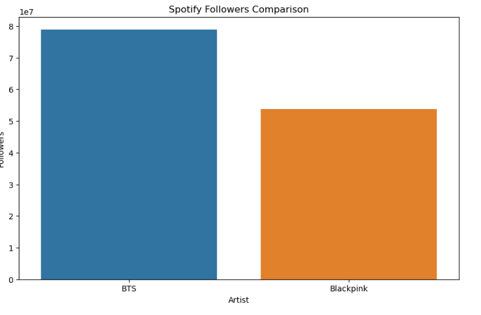
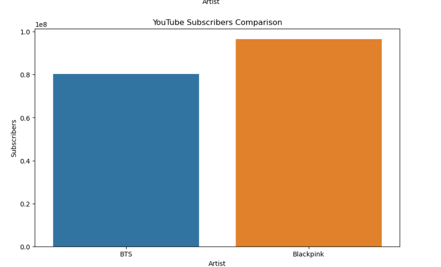

# bts-vs-blackpink-music-analysis
Comparative analysis of global music engagement metrics for BTS and Blackpink using Spotify and YouTube data.

# 📊 BTS vs Blackpink Music Listener Analysis

## 🎯 Project Objective
This project conducts a comparative analysis of **BTS** and **Blackpink**, two of the most globally recognized K-pop groups, based on their performance on **Spotify** and **YouTube**. By evaluating key engagement metrics, the study aims to uncover patterns in fan behavior, platform dominance, and promotional strategies.

---

## 📌 Key Observations

| **Metric**                     | **BTS**  | **Blackpink** | **Leading** |
|-------------------------------|----------|----------------|-------------|
| Spotify Followers (Millions)  | 78.94    | 53.80          | BTS         |
| Spotify Popularity Score      | 88       | 80             | BTS         |
| YouTube Subscribers (Millions)| 80.3     | 96.6           | Blackpink   |
| YouTube Views (Billions)      | 24.99    | 38.38          | Blackpink   |
| YouTube Videos Uploaded       | 2797     | 607            | BTS         |
| Spotify Growth (Normalized)   | 1.0      | 0.68153        | BTS         |
| YouTube Growth (Normalized)   | 0.65113  | 1.0            | Blackpink   |

---

## 🧠 Insights
- **BTS** is the leader on **Spotify**, with more followers and higher engagement.
- **Blackpink** excels on **YouTube**, dominating both in total views and subscriber count.
- **BTS** has a significantly higher number of uploaded videos, indicating a strategy of continuous content output.
- The normalized growth figures suggest BTS is growing faster on Spotify, while Blackpink is seeing more rapid growth on YouTube.

---

## ⚠️ Limitations
- The analysis is based on **current snapshot data** and lacks time-series trends.
- Excludes engagement from other platforms such as **Instagram**, **TikTok**, and **Apple Music**.
- No **sentiment analysis** or **geographical segmentation** of audiences has been performed.

---

## 🔮 Future Work
- Integrate **time-based trend analysis** to observe growth over months or years.
- Conduct **sentiment analysis** using Twitter and Instagram data.
- Include more platforms and measure **per-content performance** (e.g., most viewed videos/songs).

---

## ✅ Conclusion
Both BTS and Blackpink exhibit extraordinary digital presence, but they dominate different platforms:
- **BTS** leads in **streaming engagement** (Spotify).
- **Blackpink** leads in **video-based engagement** (YouTube).

These differences reflect not only their unique marketing approaches but also the varied ways their global fanbases interact with content.

---
## 📷 Visualizations

### 🎧 Spotify Followers Comparison

### 📺 YouTube Subscribers Growth

### 🔍 Overall Summary Chart

## 📌 Author

**Paulu Wilson**  
*Data Science Enthusiast | Music Analytics Explorer*

---

## 📄 License

MIT License

Copyright (c) 2025 Paulu Wilson

Permission is hereby granted, free of charge, to any person obtaining a copy
of this software and associated documentation files (the "Software"), to deal
in the Software without restriction, including without limitation the rights
to use, copy, modify, merge, publish, distribute, sublicense, and/or sell
copies of the Software, and to permit persons to whom the Software is
furnished to do so, subject to the following conditions:

The above copyright notice and this permission notice shall be included in all
copies or substantial portions of the Software.

THE SOFTWARE IS PROVIDED "AS IS", WITHOUT WARRANTY OF ANY KIND, EXPRESS OR
IMPLIED, INCLUDING BUT NOT LIMITED TO THE WARRANTIES OF MERCHANTABILITY,
FITNESS FOR A PARTICULAR PURPOSE AND NONINFRINGEMENT. IN NO EVENT SHALL THE
AUTHORS OR COPYRIGHT HOLDERS BE LIABLE FOR ANY CLAIM, DAMAGES OR OTHER
LIABILITY, WHETHER IN AN ACTION OF CONTRACT, TORT OR OTHERWISE, ARISING FROM,
OUT OF OR IN CONNECTION WITH THE SOFTWARE OR THE USE OR OTHER DEALINGS IN THE
SOFTWARE.

